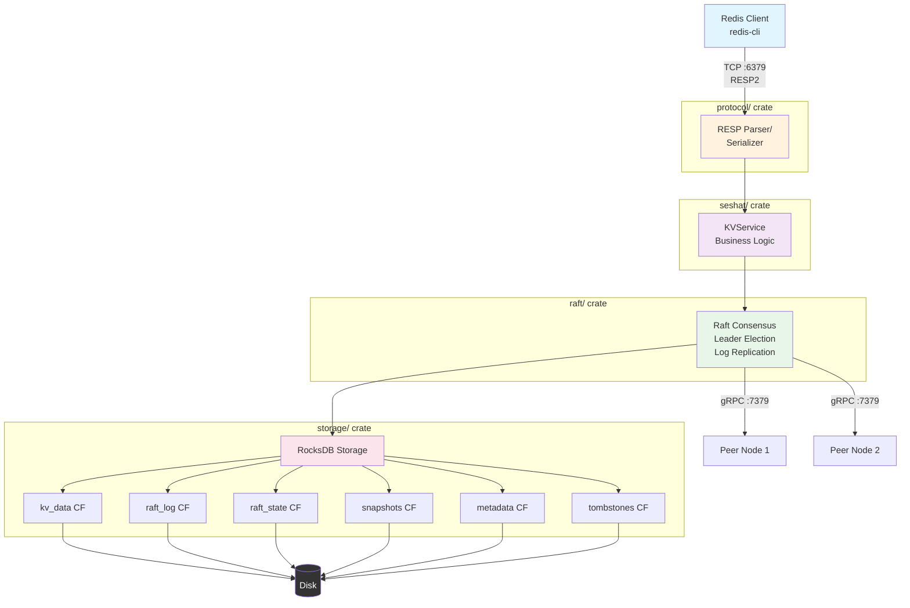
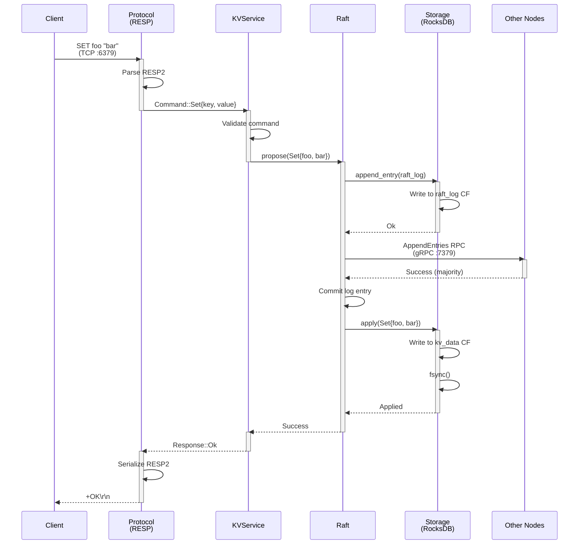
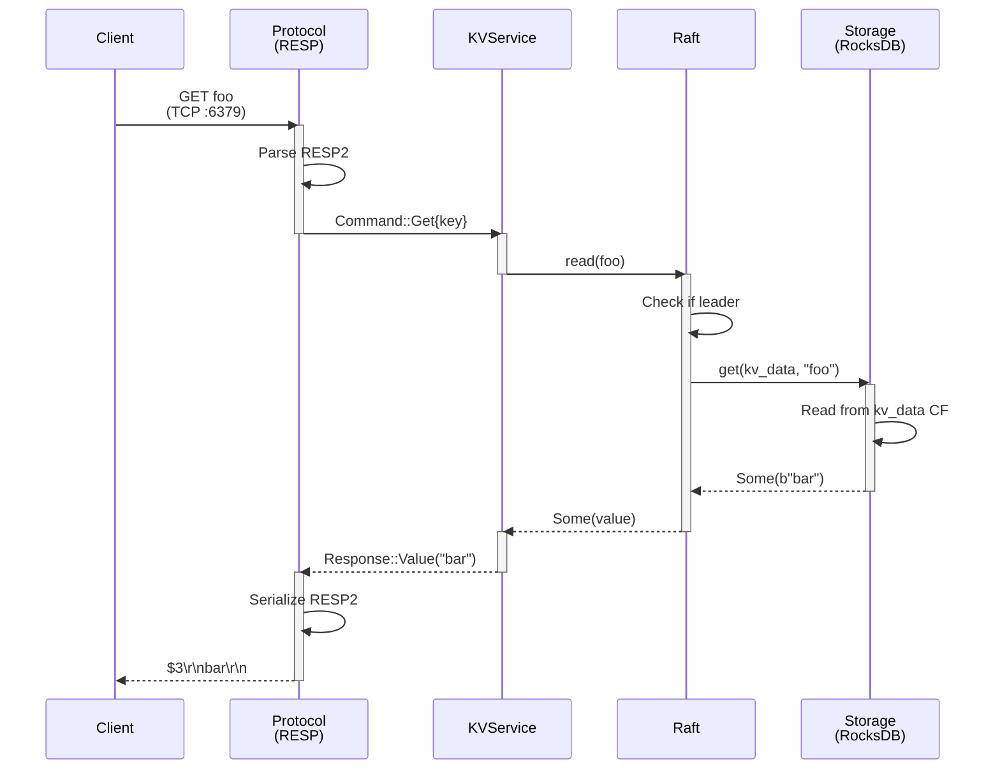
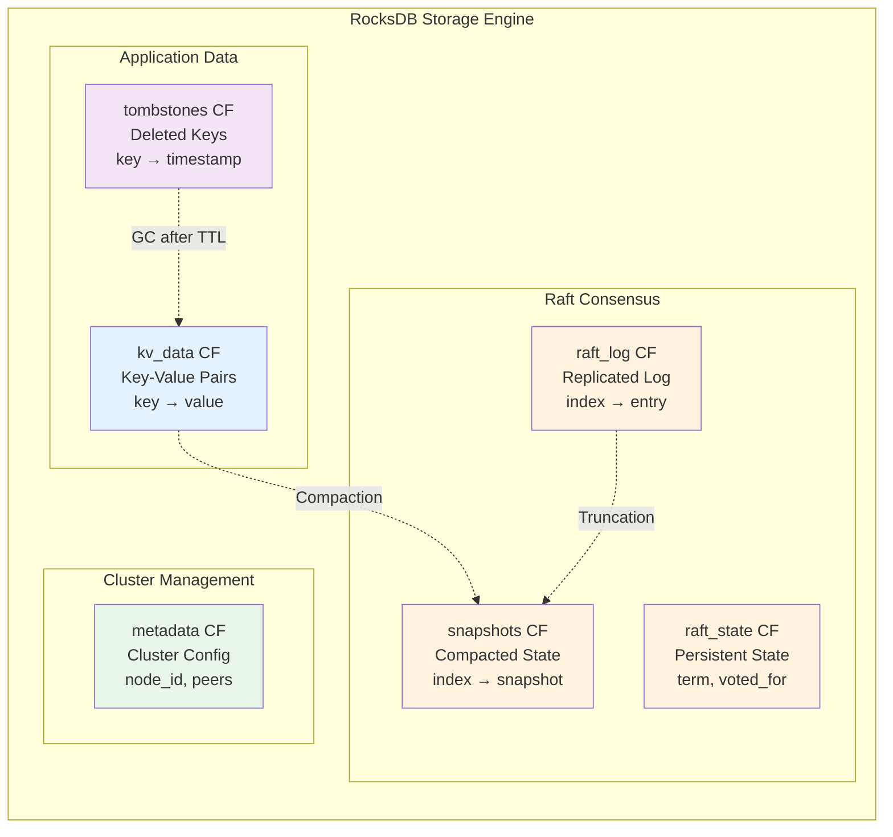
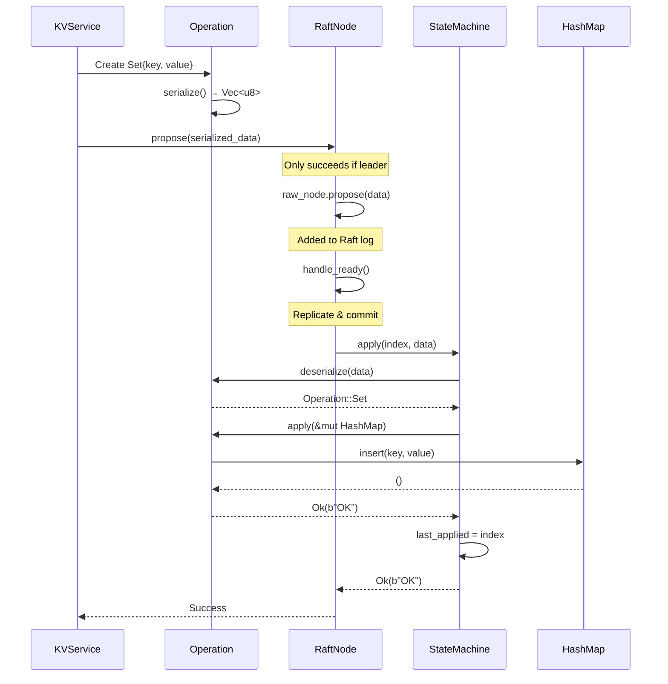
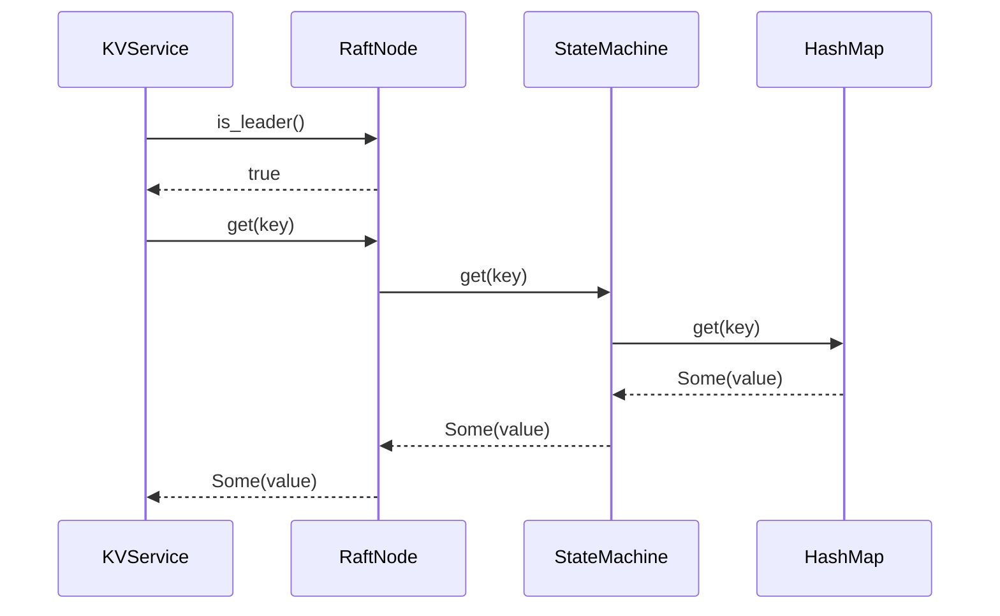
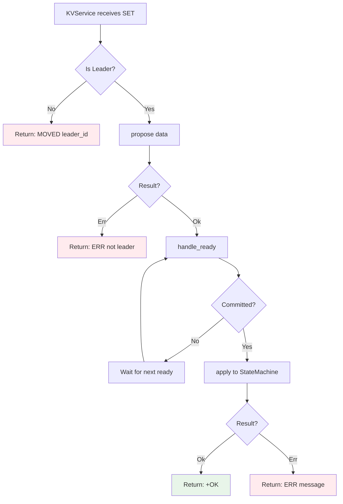

# Data Flow Architecture

This document illustrates how data flows through Seshat from network to disk and back.

## Table of Contents

- [High-Level Architecture](#high-level-architecture)
- [Write Path (SET command)](#write-path-set-command)
- [Read Path (GET command)](#read-path-get-command)
- [Cluster Replication](#cluster-replication)
- [Storage Layer Details](#storage-layer-details)

## High-Level Architecture



## Write Path (SET command)



## Read Path (GET command)



## Cluster Replication

```mermaid
graph LR
    subgraph "Node 1 (Leader)"
        L1[Raft Leader]
        LS1[(RocksDB)]
        L1 --> LS1
    end

    subgraph "Node 2 (Follower)"
        F1[Raft Follower]
        FS1[(RocksDB)]
        F1 --> FS1
    end

    subgraph "Node 3 (Follower)"
        F2[Raft Follower]
        FS2[(RocksDB)]
        F2 --> FS2
    end

    L1 -->|1. AppendEntries<br/>gRPC :7379| F1
    L1 -->|1. AppendEntries<br/>gRPC :7379| F2

    F1 -.->|2. ACK| L1
    F2 -.->|2. ACK| L1

    L1 -->|3. Commit<br/>(after majority)| LS1
    F1 -->|3. Apply| FS1
    F2 -->|3. Apply| FS2

    style L1 fill:#4caf50,color:#fff
    style F1 fill:#2196f3,color:#fff
    style F2 fill:#2196f3,color:#fff
```

## Storage Layer Details



## KV-to-Raft Interface

The interface between the key-value layer and Raft consensus is defined through the `Operation` type and the `RaftNode` API.

```mermaid
graph TB
    subgraph "Protocol Layer (seshat_protocol)"
        Op[Operation enum<br/>• Set {key, value}<br/>• Del {key}]
        Ser[serialize: Operation → Vec<u8>]
        Deser[deserialize: Vec<u8> → Operation]
        Apply[apply: HashMap → Result]
    end

    subgraph "Raft Layer (seshat_raft)"
        RN[RaftNode]
        Propose[propose Vec<u8>]
        Ready[handle_ready]
        SM[StateMachine]
        SMApply[apply index, data]
        Get[get key]
    end

    subgraph "Application Layer (seshat)"
        KV[KVService]
    end

    KV -->|"1. Create Operation"| Op
    Op -->|"2. Serialize"| Ser
    Ser -->|"3. propose data"| Propose
    Propose --> RN

    RN -->|"4. Replicate to majority"| Ready
    Ready -->|"5. Committed entries"| SMApply
    SMApply -->|"6. Deserialize"| Deser
    Deser -->|"7. Execute"| Apply
    Apply --> SM

    KV -->|"Read: get key"| Get
    Get --> SM

    style Op fill:#e3f2fd
    style RN fill:#e8f5e9
    style SM fill:#fce4ec
    style KV fill:#f3e5f5
```

### Key Interfaces

#### 1. Operation API (protocol crate)

```rust
pub enum Operation {
    Set { key: Vec<u8>, value: Vec<u8> },
    Del { key: Vec<u8> },
}

impl Operation {
    // Serialize to bytes for Raft log
    pub fn serialize(&self) -> Result<Vec<u8>>;

    // Deserialize from Raft log entry
    pub fn deserialize(bytes: &[u8]) -> Result<Operation>;

    // Apply to state HashMap
    pub fn apply(&self, state: &mut HashMap) -> Result<Vec<u8>>;
}
```

#### 2. RaftNode API (raft crate)

```rust
pub struct RaftNode {
    id: u64,
    raw_node: RawNode<MemStorage>,
    state_machine: StateMachine,
}

impl RaftNode {
    // Propose a command for consensus (writes)
    pub fn propose(&mut self, data: Vec<u8>) -> Result<()>;

    // Process Raft ready state (drive consensus)
    pub fn handle_ready(&mut self) -> Result<Vec<Message>>;

    // Read from state machine (reads)
    pub fn get(&self, key: &[u8]) -> Option<Vec<u8>>;

    // Check leadership (route requests)
    pub fn is_leader(&self) -> bool;
    pub fn leader_id(&self) -> Option<u64>;

    // Drive Raft timing
    pub fn tick(&mut self) -> Result<()>;
}
```

#### 3. StateMachine API (raft crate)

```rust
pub struct StateMachine {
    data: HashMap<Vec<u8>, Vec<u8>>,
    last_applied: u64,
}

impl StateMachine {
    // Apply committed log entry
    pub fn apply(&mut self, index: u64, data: &[u8]) -> Result<Vec<u8>>;

    // Read current state
    pub fn get(&self, key: &[u8]) -> Option<Vec<u8>>;
    pub fn exists(&self, key: &[u8]) -> bool;

    // Snapshots for log compaction
    pub fn snapshot(&self) -> Result<Vec<u8>>;
    pub fn restore(&mut self, snapshot: &[u8]) -> Result<()>;

    // Progress tracking
    pub fn last_applied(&self) -> u64;
}
```

### Write Path: SET Command



### Read Path: GET Command



### Data Transformations

```mermaid
graph LR
    subgraph "Client Request"
        CR[Redis RESP<br/>SET foo bar]
    end

    subgraph "Protocol Parsing"
        CMD[Command::Set<br/>{key: foo, value: bar}]
    end

    subgraph "Operation Creation"
        OP[Operation::Set<br/>{key: [102,111,111], value: [98,97,114]}]
    end

    subgraph "Serialization"
        BYTES[Vec<u8><br/>[0,3,102,111,111,3,98,97,114]]
    end

    subgraph "Raft Log Entry"
        ENTRY[Entry<br/>{index: 5, data: bytes}]
    end

    subgraph "State Machine"
        HM[HashMap<br/>foo → bar]
    end

    subgraph "Client Response"
        RESP[Redis RESP<br/>+OK\r\n]
    end

    CR --> CMD
    CMD --> OP
    OP --> BYTES
    BYTES --> ENTRY
    ENTRY -.Commit & Apply.-> BYTES
    BYTES --> OP
    OP --> HM
    HM --> RESP
```

### Interface Contract

**KVService responsibilities:**
- Parse client commands into `Operation` types
- Call `propose()` for writes (returns error if not leader)
- Call `get()` for reads (leader serves from local state)
- Handle leadership changes (redirect to current leader)
- Serialize responses back to client protocol

**RaftNode responsibilities:**
- Accept proposals via `propose()` (leader only)
- Replicate entries to majority via `handle_ready()`
- Apply committed entries to `StateMachine`
- Track leadership status for request routing
- Provide read access via `get()` (linearizable on leader)

**StateMachine responsibilities:**
- Deserialize `Operation` from log entry data
- Execute operations on internal `HashMap`
- Enforce idempotency (reject duplicate indexes)
- Track `last_applied` index for snapshots
- Provide snapshot/restore for log compaction

### Error Handling



## Data Flow Summary

### Write Path Layers

1. **Network → Protocol** (TCP :6379)
   - RESP2 parsing
   - Command deserialization

2. **Protocol → KVService** (in-process)
   - Command validation
   - Business logic

3. **KVService → Raft** (in-process)
   - Consensus proposal
   - Leader election check

4. **Raft → Storage** (in-process)
   - Log append (raft_log CF)
   - State machine apply (kv_data CF)

5. **Raft → Peers** (gRPC :7379)
   - AppendEntries RPC
   - Replication to followers

6. **Storage → Disk** (RocksDB)
   - Write-ahead log (WAL)
   - SSTable compaction
   - fsync for durability

### Read Path Layers

1. **Network → Protocol** (TCP :6379)
   - RESP2 parsing

2. **Protocol → KVService** (in-process)
   - Command routing

3. **KVService → Raft** (in-process)
   - Leadership check
   - Read-index for linearizability (optional)

4. **Raft → Storage** (in-process)
   - Read from kv_data CF

5. **Storage → Disk** (RocksDB)
   - Block cache lookup
   - SSTable read if cache miss

6. **Response path reverses up the stack**

## Performance Considerations

### Write Latency Components

- **Network parsing**: ~0.1ms (RESP2 is simple)
- **Raft append**: ~0.5ms (WAL write)
- **Network replication**: ~1-2ms (gRPC + network RTT)
- **State machine apply**: ~0.5ms (RocksDB write)
- **Total**: ~2-3ms typical, ~10ms p99

### Read Latency Components

- **Network parsing**: ~0.1ms
- **RocksDB read**: ~0.1ms (cache hit), ~1ms (SSD seek)
- **Total**: ~0.2ms typical (cached), ~1-2ms (disk)

### Optimization Opportunities

1. **Batch writes**: Group multiple commands into single Raft proposal
2. **Read cache**: In-memory LRU for hot keys
3. **Follower reads**: Stale reads from followers (eventual consistency)
4. **Pipeline**: Async RESP2 pipelining for throughput
