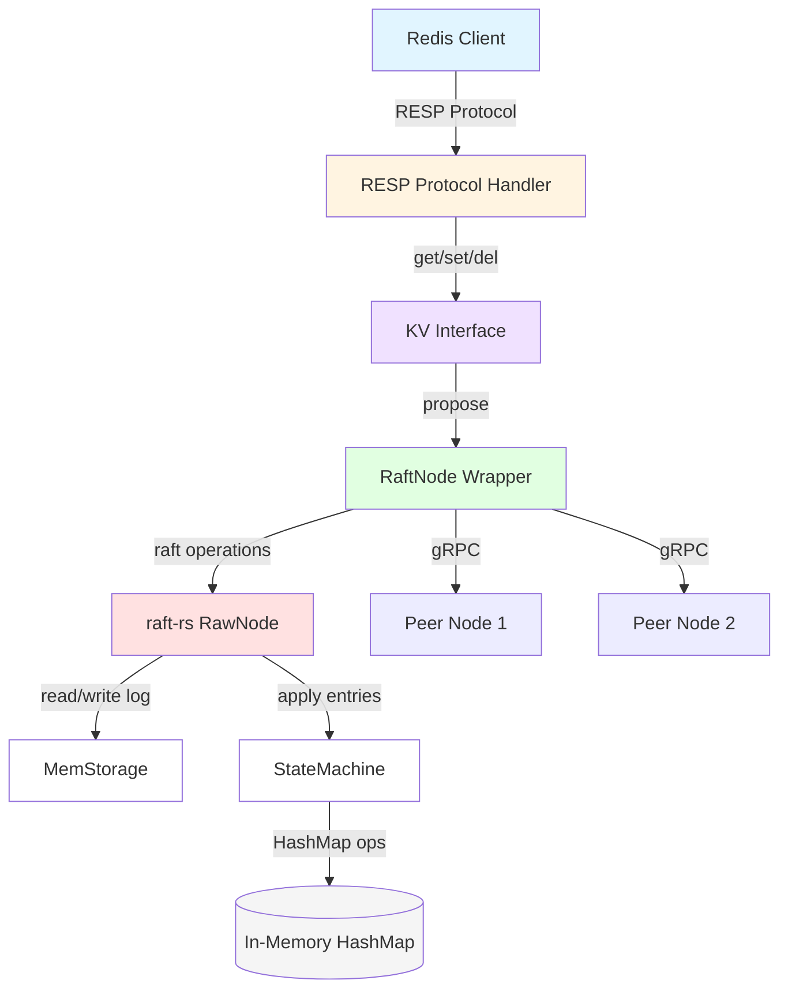
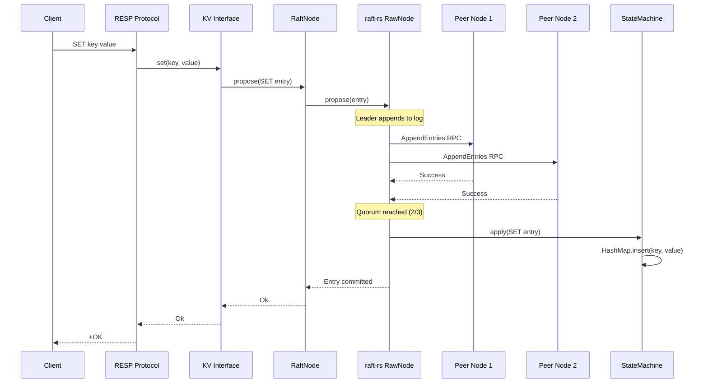
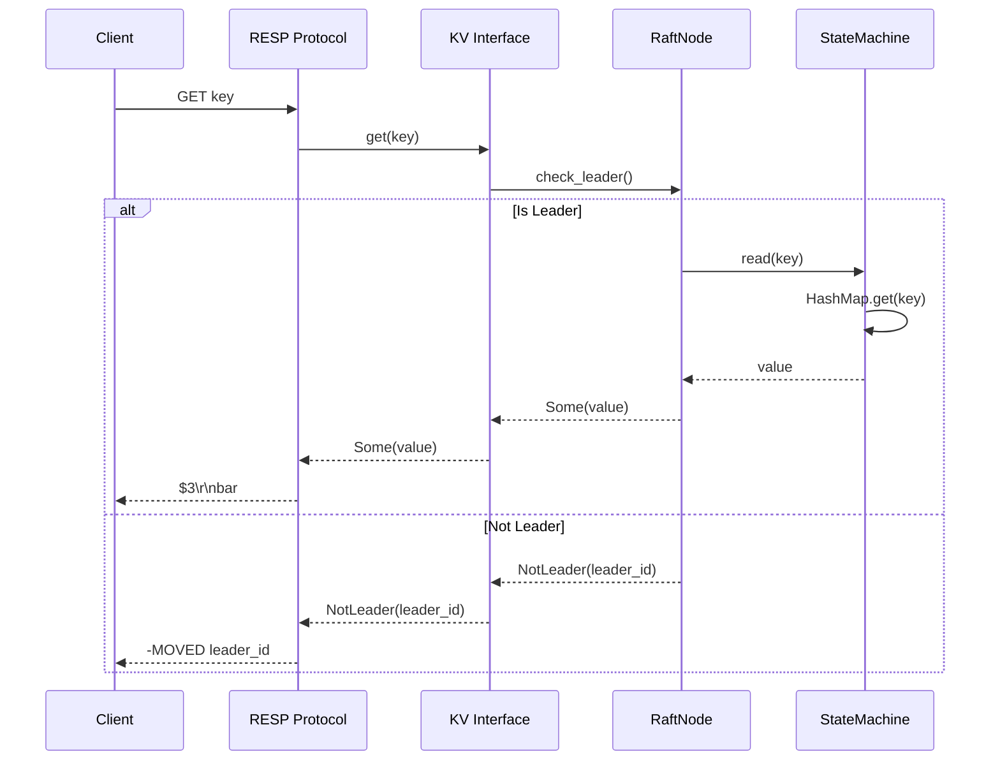
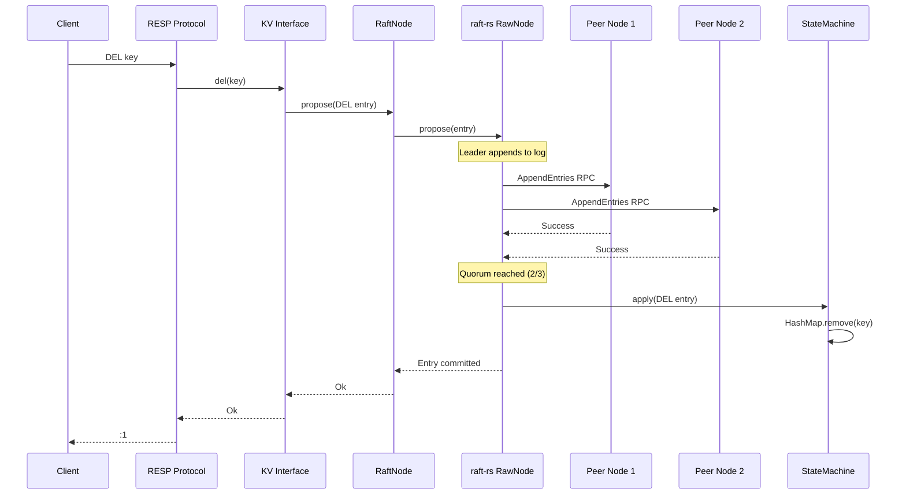

# Seshat: Distributed Key-Value Store

## Product Definition
Seshat is a distributed, Redis-compatible key-value store built in Rust with Raft consensus for learning distributed systems fundamentals.

## Target Users
- Systems engineers exploring distributed systems
- Backend developers learning distributed systems internals
- Platform engineers seeking a reference implementation of a distributed key-value store

## Core Features (Phase 1 MVP)

### Raft Consensus
- Leader election with automatic failover
- Log replication with majority quorum
- Strong consistency guarantees
- Log compaction via snapshots (trigger at 10,000 entries)
- Membership changes via joint consensus

### Redis Protocol (RESP2)
Supported commands:
- `GET key` - Retrieve value
- `SET key value` - Store key-value pair
- `DEL key [key ...]` - Delete one or more keys
- `EXISTS key [key ...]` - Check if keys exist
- `PING [message]` - Health check / connectivity test

Error responses:
- `(error) ERR key too large` - Key exceeds 256 bytes
- `(error) ERR value too large` - Value exceeds 64KB
- `(error) MOVED <leader_id>` - Not leader, redirect to leader
- `(error) NOQUORUM` - Cannot reach majority of nodes

### Storage
- Single RocksDB instance per node
- Multiple column families:
  - `system_raft_log`: System Raft group log entries
  - `system_raft_state`: System Raft group hard state
  - `system_data`: Cluster metadata (membership, shard map)
  - `data_raft_log`: Data shard Raft log entries
  - `data_raft_state`: Data shard hard state
  - `data_kv`: Actual key-value data
- Atomic batch writes
- Snapshot creation every 10,000 entries or 100MB log size

### Networking
- **Client-facing**: RESP protocol on port 6379
- **Internal RPC**: gRPC on port 7379
- DNS-based service discovery (works with Kubernetes, Docker Compose)
- Connection pooling and retry logic

### Resource Limits
- Max key size: 256 bytes
- Max value size: 64KB
- Max concurrent client connections: 10,000
- Max Raft log memory per group: 512MB
- Request timeout: 30 seconds
- Raft RPC timeout: 5 seconds

## Success Metrics

### Stability Criteria
- ✅ 3-node cluster runs stably for 1+ hours under continuous load
- ✅ Cluster formation completes within 5 seconds
- ✅ Leader election converges in <2 seconds after failure
- ✅ Log compaction triggers at 10,000 entries without errors
- ✅ Snapshot creation completes within 10 seconds for 1M keys

### Chaos Test Matrix (All Must Pass)
1. **Leader failure**: Kill leader → new leader elected within 2s
2. **Follower failure**: Kill follower → cluster continues with 2-node quorum
3. **Network partition (2-1 split)**: Majority partition continues, minority rejects writes
4. **Asymmetric partition**: Old leader steps down when isolated
5. **Leader isolation**: Isolated leader cannot commit, new leader elected
6. **Cascading failures**: After 2 failures, cluster loses quorum (expected)
7. **Kill leader during write**: No data corruption, deterministic outcome
8. **Full cluster restart**: All data persisted, cluster reforms
9. **Slow network (100ms latency)**: Cluster remains available
10. **Log compaction under load**: Memory usage stays bounded
11. **Clock skew**: Cluster unaffected by 30s time difference

### Performance Targets
- **Throughput**: >5,000 ops/sec per node (single client)
- **Latency**:
  - GET: <5ms p99 (read from leader)
  - SET: <10ms p99 (includes Raft replication to majority)
- **Recovery**:
  - Leader election: <2 seconds
  - Node restart (warm): <30 seconds for 10GB dataset
  - Node restart (cold): <5 minutes for 10GB dataset
- **Resource Usage**:
  - Memory: <100MB baseline + data size
  - CPU: <50% on leader during peak load
  - Network: <100Mbps between nodes

## Design Philosophy
- Learning-focused distributed systems implementation
- Prioritize clarity and educational value
- Implement core distributed systems patterns from first principles

## Configuration Example

### Bootstrap Mode (Initial Cluster Formation)

```toml
[node]
id = 1  # Unique node ID (1, 2, 3 for founding members)
client_addr = "0.0.0.0:6379"      # Bind for Redis clients
internal_addr = "0.0.0.0:7379"    # Bind for internal Raft RPC
data_dir = "/var/lib/seshat"
# advertise_addr = "kvstore-1:7379"  # Auto-detected from hostname

[cluster]
bootstrap = true  # Enable bootstrap mode

# All founding members (same list on all nodes)
initial_members = [
  {id = 1, addr = "kvstore-1:7379"},
  {id = 2, addr = "kvstore-2:7379"},
  {id = 3, addr = "kvstore-3:7379"},
]

replication_factor = 3

[raft]
heartbeat_interval_ms = 100
election_timeout_min_ms = 500
election_timeout_max_ms = 1000
snapshot_interval_entries = 10000
snapshot_interval_bytes = 100000000  # 100MB
max_log_size_bytes = 500000000       # 500MB

[limits]
max_key_size_bytes = 256
max_value_size_bytes = 65536  # 64KB
max_concurrent_client_connections = 10000
max_memory_per_raft_log_mb = 512
request_timeout_secs = 30
raft_rpc_timeout_secs = 5
```

### Join Mode (Add Node to Existing Cluster)

```toml
[node]
id = 4  # New unique ID
client_addr = "0.0.0.0:6379"
internal_addr = "0.0.0.0:7379"
data_dir = "/var/lib/seshat"

[cluster]
bootstrap = false
join_addr = "kvstore-1:7379"  # Any existing node
replication_factor = 3

[raft]
# Same settings as existing cluster
heartbeat_interval_ms = 100
election_timeout_min_ms = 500
election_timeout_max_ms = 1000
```

## Development Roadmap - Spec Sequence

### Phase 1: Core Implementation (4 Specs)

This section documents the implementation order for Phase 1 MVP features. Each spec represents a cohesive unit of work that delivers a specific capability.

#### 1. raft (Foundation - Consensus Components + Networking)
**Status**: In Design
**Deliverable**: Raft components that can communicate

**Scope**:
- Core: MemStorage, StateMachine, RaftNode wrapper
- Protobuf: Message definitions (.proto files)
- Network: gRPC client/server for Raft RPC (server + client implementation)
- Connection pooling and retry logic
- Tests: Unit tests + basic 2-node integration (message exchange)

**Success Criteria**:
- ✅ 2 nodes can exchange Raft messages via gRPC
- ✅ Storage trait fully implemented with 100% test coverage
- ✅ State machine correctly applies SET/DEL operations in order
- ✅ Configuration validation catches all invalid configs
- ✅ Integration test passes: RequestVote and AppendEntries work via gRPC

**Why First**: Foundation - can't do anything without consensus and message passing

---

#### 2. rocksdb-storage (Persistence)
**Status**: Not Started
**Deliverable**: Durable storage that survives restarts

**Scope**:
- Migrate from MemStorage to RocksDB
- 6 column families (system/data, raft logs/state/data)
- Snapshot creation and restoration
- Implement raft::Storage trait with RocksDB backend
- Migration path from in-memory to persistent storage

**Success Criteria**:
- ✅ Data persists across node restarts
- ✅ Snapshots created at 10,000 entries or 100MB
- ✅ Log compaction works correctly
- ✅ All existing tests pass with RocksDB backend

**Why Second**: Add persistence while Raft implementation is fresh in mind

---

#### 3. resp-protocol-mvp (Client Interface)
**Status**: Not Started
**Deliverable**: Redis clients can connect and execute commands

**Scope**:
- Redis RESP protocol parser/serializer
- GET, SET, DEL, EXISTS, PING commands
- Client-facing network layer (port 6379)
- Wire RESP commands to Raft consensus
- Error handling (NOT_LEADER, NOQUORUM)

**Success Criteria**:
- ✅ redis-cli can connect to any node
- ✅ GET/SET/DEL operations work end-to-end
- ✅ Leader redirection works (MOVED errors)
- ✅ Writes replicate to all 3 nodes
- ✅ Reads return consistent values

**Why Third**: Add client interface - now have complete end-to-end flow

---

#### 4. chaos-testing (Validation)
**Status**: Not Started
**Deliverable**: Production-ready fault-tolerant cluster

**Scope**:
- Full 3-node cluster testing
- All 11 chaos scenarios from PRD:
  1. Leader failure → new leader elected within 2s
  2. Follower failure → cluster continues with 2-node quorum
  3. Network partition (2-1 split) → majority continues, minority rejects writes
  4. Asymmetric partition → old leader steps down
  5. Leader isolation → new leader elected
  6. Cascading failures → cluster loses quorum (expected)
  7. Kill leader during write → no data corruption
  8. Full cluster restart → all data persisted
  9. Slow network (100ms latency) → cluster remains available
  10. Log compaction under load → memory bounded
  11. Clock skew → cluster unaffected
- Performance validation (>5,000 ops/sec, <10ms p99 latency)
- Stability testing (1+ hours continuous operation)

**Success Criteria**:
- ✅ All 11 chaos tests pass consistently
- ✅ Leader election converges within 2 seconds
- ✅ Split-brain prevention works (minority rejects writes)
- ✅ No data loss in any failure scenario
- ✅ Performance targets met
- ✅ Cluster runs stably for 1+ hours under load

**Why Last**: Validate everything works under stress with complete system

---

### Implementation Philosophy

**Build → Integrate → Validate**

1. **raft**: Build core components and message passing (unit + 2-node integration)
2. **rocksdb-storage**: Add persistence layer (durable storage)
3. **resp-protocol-mvp**: Add client interface (complete end-to-end flow)
4. **chaos-testing**: Stress test the complete system (validate fault tolerance)

Each spec delivers working, testable functionality. No spec depends on future specs. Tests grow more complex: unit → integration (2 nodes) → full cluster (3+ nodes) → chaos.

---

## Architecture and Data Flow

### Component Architecture



### SET Operation Flow



### GET Operation Flow



### DEL Operation Flow



**Key Observations**:
- **Write operations (SET/DEL)**: Go through full Raft consensus with 2-of-3 quorum
- **Read operations (GET)**: Leader-only reads in Phase 1 (no consensus required)
- **Not-leader handling**: Clients redirected to current leader with MOVED error
- **Strong consistency**: All writes must be committed by majority before returning

---

## Future Phases

**Phase 2**: Multi-shard cluster with horizontal scalability
**Phase 3**: Dynamic cluster management (add/remove nodes gracefully)
**Phase 4**: Production readiness (metrics, monitoring, rolling upgrades)
**Phase 5**: SQL interface (PostgreSQL wire protocol over same distributed storage)