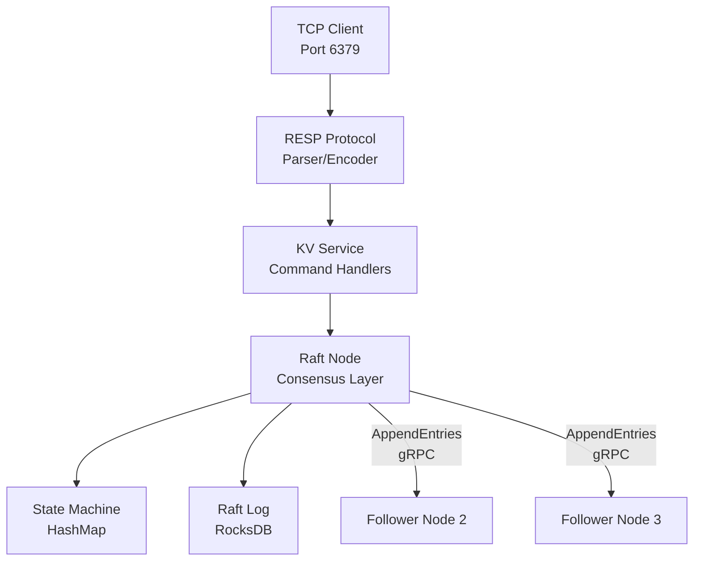

# Technical Design: KV Service

## Overview

The KV service layer is a critical component of Seshat that bridges the RESP protocol layer with the Raft consensus system. It receives parsed RESP commands, translates them into Raft proposals or local reads, implements Redis command semantics, validates inputs, and handles leader redirection.

**Core Principle**: All state changes go through Raft consensus. KvService never directly accesses storage - it always routes through RaftNode.

## Dependencies

**⚠️ CRITICAL BLOCKER**: This specification requires the **OpenRaft migration** (see `docs/specs/openraft/`) to be **100% complete** before KvService implementation can begin. The design uses async/await patterns that depend on OpenRaft's async APIs.

**Implementation Order**:
1. **Complete OpenRaft migration first** (all 6 phases in `docs/specs/openraft/`)
2. Complete RocksDB storage integration (see `docs/specs/rocksdb/`)
3. Then implement KvService with async handlers

**Required OpenRaft Changes**:
- `raft_node.propose(data).await` - **NOW ASYNC**: Returns `Result<ClientWriteResponse>`
- `raft_node.get(key)` - **STILL SYNC**: Direct StateMachine access (NO internal leadership check)
- `raft_node.is_leader().await` - **NOW ASYNC**: Must be called before reads
- `raft_node.leader_id().await` - **NOW ASYNC**: For MOVED error responses
- **Error types**: Changed from raft-rs to openraft errors
- **Serialization**: Changed from bincode to protobuf (prost)

These dependencies exist because:
- OpenRaft provides async APIs (`propose().await`) that KvService requires
- RocksDB provides persistent storage that StateMachine requires
- KvService cannot function without both consensus (OpenRaft) and persistence (RocksDB)

## Architecture Pattern

### Distributed Systems Service Layer

Unlike traditional web applications that follow the Router → Service → Repository → Entity → Database pattern, KvService is a **distributed systems component** that integrates with Raft consensus for strong consistency guarantees.



### Data Flow Patterns

**Write Operations**:
```
KvService validates → serializes Operation → RaftNode::propose() →
Raft log replication → majority commit → StateMachine::apply() → return success
```

**Read Operations**:
```
KvService checks leadership → RaftNode::get() → StateMachine HashMap → return value
```

**Leadership Routing**:
Followers redirect writes to leader via MOVED error. Leaders serve both reads and writes.

## Domain Model

### KvService Struct

```rust
pub struct KvService {
    raft_node: Arc<RaftNode>
}
```

**Ownership**: Owns `Arc<RaftNode>` for thread-safe access across async tasks

**Responsibility**: Command routing, input validation, RESP response formatting

**No State**: KvService is stateless - all state lives in RaftNode's StateMachine

**Thread Safety**: Clone-able via Arc, safe to use across tokio tasks

### Operation Enum

**Location**: `crates/kv/src/operations.rs` (already implemented)

```rust
use prost::Message;

#[derive(Message)]
pub enum Operation {
    /// Insert or update key-value pair
    Set { key: Vec<u8>, value: Vec<u8> },
    /// Delete key from state machine
    Del { key: Vec<u8> }
}

impl Operation {
    pub fn apply(&self, state: &mut HashMap<Vec<u8>, Vec<u8>>) -> OperationResult<Vec<u8>> {
        // Apply operation to state machine
    }

    pub fn encode_to_vec(&self) -> Vec<u8> {
        // Protobuf serialization
    }

    pub fn decode(data: &[u8]) -> Result<Self, prost::DecodeError> {
        // Protobuf deserialization
    }
}
```

**Serialization**: Uses **protobuf (prost)** for Raft log entries (replaces bincode)

**Rationale for Protobuf**:
- Schema evolution support (forward/backward compatibility)
- Consistent with storage layer and network layer
- Better cross-language compatibility
- Aligns with OpenRaft's recommended approach

**Idempotency**:
- SET is idempotent (last write wins)
- DEL is idempotent (returns 0 if key doesn't exist)

### StateMachine

**Location**: `crates/raft/src/state_machine.rs` (implemented)

```rust
#[derive(Debug, Clone, Serialize, Deserialize)]
pub struct StateMachine {
    /// The key-value data store
    data: HashMap<Vec<u8>, Vec<u8>>,
    /// The last applied log index
    last_applied: u64,
}
```

**Key Methods**:
- `get(&self, key: &[u8]) -> Option<Vec<u8>>` - Read-only lookup, returns cloned value
- `exists(&self, key: &[u8]) -> bool` - Check key existence without cloning value
- `apply(&mut self, index: u64, data: &[u8]) -> Result<Vec<u8>>` - Apply log entry
- `snapshot(&self) -> Result<Vec<u8>>` - Serialize entire state for snapshots
- `restore(&mut self, snapshot: &[u8]) -> Result<()>` - Restore from snapshot
- `last_applied(&self) -> u64` - Get highest applied log index

**Storage**: In-memory `HashMap<Vec<u8>, Vec<u8>>` for fast lookups

**Thread Safety**:
- StateMachine itself is NOT thread-safe (no internal locking)
- RaftNode wraps it with appropriate synchronization (RwLock or Mutex)
- Multiple concurrent reads are safe via RaftNode's locking
- Writes are serialized through Raft consensus

**Apply Logic**:
1. Idempotency check - rejects if `index <= last_applied`
2. Deserializes Operation from bytes
3. Calls `Operation::apply()` on internal HashMap
4. Updates `last_applied` to track progress
5. Returns operation result bytes

**Last Applied**: Prevents duplicate application and ensures exactly-once semantics

**Persistence**: State machine is rebuilt from Raft log on restart (or restored from snapshot)

### RaftNode

**Location**: `crates/raft/src/node.rs` (implemented with OpenRaft)

**Key Methods** (After OpenRaft Migration):
- `async fn propose(&self, data: Vec<u8>) -> Result<ClientWriteResponse>` - **ASYNC** - Submit write to Raft, waits for commit
- `fn get(&self, key: &[u8]) -> Option<Vec<u8>>` - **SYNC** - Direct StateMachine access (**WARNING: Does NOT check leadership internally**)
- `async fn is_leader(&self) -> bool` - **ASYNC** - Check if this node is leader
- `async fn leader_id(&self) -> Option<u64>` - **ASYNC** - Get current leader ID for redirection

**Consensus**: Wraps openraft `Raft`, handles leader election, log replication, commit tracking

**gRPC**: Integrated gRPC transport for AppendEntries, RequestVote, InstallSnapshot messages

### OpenRaft API Changes

**IMPORTANT**: After OpenRaft migration, RaftNode uses openraft's async API.

**API Changes from raft-rs**:
```rust
// OLD (raft-rs - synchronous):
impl RaftNode {
    fn propose(&mut self, data: Vec<u8>) -> Result<()>  // Sync
    fn get(&self, key: &[u8]) -> Option<Vec<u8>>       // Sync
    fn is_leader(&self) -> bool                         // Sync
    fn leader_id(&self) -> Option<u64>                  // Sync
}

// NEW (openraft - asynchronous):
impl RaftNode {
    async fn propose(&self, data: Vec<u8>) -> Result<ClientWriteResponse>  // Async!
    fn get(&self, key: &[u8]) -> Option<Vec<u8>>                           // Still sync (direct StateMachine access)
    async fn is_leader(&self) -> bool                                      // Async!
    async fn leader_id(&self) -> Option<u64>                               // Async!
}
```

**Critical Leadership Check Contract**:
- `RaftNode::get()` does NOT check leadership internally (direct HashMap access)
- KvService MUST call `is_leader().await` before calling `get()`
- Without this check, followers will serve stale reads
- This is intentional in Phase 1 for simplicity (Phase 4 adds ReadIndex for linearizable reads)

**Error Type Changes**:
- raft-rs errors → openraft errors
- Different error variants and semantics
- KvServiceError must map from openraft error types

## API Specification

### Type
Internal Rust async API (not HTTP REST or gRPC)

### Interface
KvService methods are async and return `Result<RespValue, KvServiceError>`

### Command Handlers

#### handle_get

```rust
async fn handle_get(&self, key: Vec<u8>) -> Result<RespValue, KvServiceError>
```

**Behavior**:
1. **MUST** check if leader via `raft_node.is_leader().await` for consistency
2. If not leader, return `NotLeader` error
3. If leader, call `raft_node.get(&key)` (sync - direct StateMachine HashMap access)
4. Return `RespValue::BulkString(value)` or `RespValue::Null`

**Implementation**:
```rust
async fn handle_get(&self, key: Vec<u8>) -> Result<RespValue, KvServiceError> {
    // MUST check leadership first (get() doesn't check internally)
    if !self.raft_node.is_leader().await {  // <-- .await added
        let leader_id = self.raft_node.leader_id().await;  // <-- .await added
        return Err(KvServiceError::NotLeader { leader_id });
    }

    // get() is sync (direct StateMachine access)
    match self.raft_node.get(&key) {
        Some(value) => Ok(RespValue::BulkString(value.into())),
        None => Ok(RespValue::Null),
    }
}
```

**Read Consistency Model - Leadership Transition Race**:
- Reads may be stale during leadership transitions (window of ~100ms)
- While KvService checks `is_leader().await` before reads, leadership can change before `get()` completes
- `is_leader()` is async (checks openraft state)
- `get()` is sync (direct StateMachine HashMap access, no internal leadership check)
- **Race window**: Between `is_leader().await` returning true and `get()` executing
- Old leader may serve reads briefly after losing leadership
- New leader may not have all committed entries immediately after election
- Clients may observe "time travel": newer value → older value → newer value
- Phase 4 will add linearizable reads via ReadIndex to eliminate this race

**Errors**: `NotLeader` if not leader (prevents most stale reads, but race condition still exists)

**Latency Target**: < 5ms p99 (in-memory HashMap lookup + leadership check)

#### handle_set

```rust
async fn handle_set(&self, key: Vec<u8>, value: Vec<u8>) -> Result<RespValue, KvServiceError>
```

**Behavior**:
1. Validate key size <= 256 bytes
2. Validate value size <= 64KB
3. Create `Operation::Set { key, value }`
4. Serialize with protobuf: `operation.encode_to_vec()`
5. Call `raft_node.propose(serialized_op).await` (async/await - waits for commit)
6. Return `RespValue::Ok` on success

**Implementation**:
```rust
async fn handle_set(&self, key: Vec<u8>, value: Vec<u8>) -> Result<RespValue, KvServiceError> {
    // Validation
    validate_key_size(&key)?;
    validate_value_size(&value)?;

    // Serialize operation with protobuf
    let operation = Operation::Set { key, value };
    use prost::Message;
    let data = operation.encode_to_vec();

    // Propose via Raft (async with openraft)
    self.raft_node.propose(data).await?;  // <-- .await added

    Ok(RespValue::SimpleString("OK".into()))
}
```

**Errors**: `KeyTooLarge`, `ValueTooLarge`, `NotLeader`, `NoQuorum`, `ProposalFailed`

**Latency Target**: < 10ms p99 (includes Raft replication to 2/3 nodes)

#### handle_del

```rust
async fn handle_del(&self, keys: Vec<Vec<u8>>) -> Result<RespValue, KvServiceError>
```

**Behavior**:
1. Validate each key size <= 256 bytes
2. For each key:
   - Create `Operation::Del { key }`
   - Serialize with protobuf: `operation.encode_to_vec()`
   - Call `raft_node.propose(serialized_op).await` (async/await - waits for commit)
   - Track success/failure
3. Accumulate deleted count from successful proposals
4. Return `RespValue::Integer(deleted_count)`

**Implementation**:
```rust
async fn handle_del(&self, keys: Vec<Vec<u8>>) -> Result<RespValue, KvServiceError> {
    // Validation
    for key in &keys {
        validate_key_size(key)?;
    }

    let mut deleted_count = 0;

    // Each key is a separate Raft proposal
    for key in keys {
        let operation = Operation::Del { key };
        use prost::Message;
        let data = operation.encode_to_vec();

        // Propose (async)
        match self.raft_node.propose(data).await {  // <-- .await added
            Ok(response) => {
                // Parse response to get deletion count (1 or 0)
                deleted_count += parse_del_result(&response)?;
            }
            Err(e) => {
                // Partial failure - return what we deleted so far with error
                return Err(KvServiceError::PartialFailure {
                    completed: deleted_count,
                    error: Box::new(e),
                });
            }
        }
    }

    Ok(RespValue::Integer(deleted_count))
}
```

**Multi-Key Atomicity Semantics**:

**Approach**: Each key is a **separate Raft proposal** (not batched into a single operation)

**Rationale**:
- **Matches Redis behavior**: Redis DEL is NOT atomic across multiple keys - each key deletion is independent
- **Allows partial success**: If key1 deletes successfully but key2 fails (e.g., quorum loss), DEL returns accurate count
- **Simpler implementation**: Reuses existing `Operation::Del { key }` without adding `Operation::DelMulti` variant
- **Better fault tolerance**: Failures on one key don't prevent other keys from being deleted
- **Phase 1 simplicity**: Batched operations are a Phase 2 optimization

**Partial Failure Handling**:
- If a proposal fails (NotLeader, NoQuorum, timeout), stop processing remaining keys
- Return the count of successfully deleted keys up to that point
- Client can detect partial failure if returned count < requested key count
- Client is responsible for retry logic on partial failures

**Deleted Count Tracking**:
- Each `Operation::Del::apply()` returns `b"1"` if key existed, `b"0"` if not
- After each successful proposal/commit, parse the result bytes and increment counter
- Non-existent keys contribute 0 to the count (matches Redis semantics)
- Final count = sum of all successfully applied deletions

**Performance Trade-off**:
- **Slower than batching**: N keys require N Raft consensus rounds instead of 1
- **Acceptable for Phase 1**: Simplicity and learning objectives outweigh throughput
- **Future optimization**: Phase 2 can add `Operation::DelMulti` with batched replication

**Errors**:
- `KeyTooLarge` - If any key exceeds 256 bytes (validation happens before proposals)
- `NotLeader` - If not leader when first proposal attempted
- `NoQuorum` - If cannot reach majority during any proposal
- `ProposalFailed` - If Raft rejects proposal for any key

**Error Handling During Multi-Key**:
- **Early validation failure**: Return error immediately without proposing any keys
- **First proposal fails**: Return error with deleted_count = 0
- **Mid-sequence failure**: Return error with partial deleted_count (only successfully committed deletions)
- **Leadership change mid-operation**: New proposals fail with NotLeader, return partial count

**Redis Semantics Match**:
- DEL accepts multiple keys, returns count of deleted keys (0 if none existed)
- Non-atomic behavior matches Redis Cluster semantics (keys may be on different nodes/shards)
- Idempotent: Deleting non-existent key returns 0, doesn't fail

**Latency Target**: < 10ms p99 per key (each key requires Raft replication)

#### handle_exists

```rust
async fn handle_exists(&self, keys: Vec<Vec<u8>>) -> Result<RespValue, KvServiceError>
```

**Behavior**:
1. **MUST** check if leader via `raft_node.is_leader().await` for consistency
2. If not leader, return `NotLeader` error
3. For each key, call `raft_node.get(key)` (sync)
4. Count how many exist
5. Return `RespValue::Integer(exists_count)`

**Implementation**:
```rust
async fn handle_exists(&self, keys: Vec<Vec<u8>>) -> Result<RespValue, KvServiceError> {
    // MUST check leadership (get() doesn't check internally)
    if !self.raft_node.is_leader().await {  // <-- .await added
        let leader_id = self.raft_node.leader_id().await;  // <-- .await added
        return Err(KvServiceError::NotLeader { leader_id });
    }

    let mut exists_count = 0;
    for key in &keys {
        if self.raft_node.get(key).is_some() {
            exists_count += 1;
        }
    }

    Ok(RespValue::Integer(exists_count))
}
```

**Errors**: `NotLeader` if not leader (prevents most stale reads, but race condition still exists)

**Redis Semantics**: EXISTS accepts multiple keys, returns count of existing keys

#### handle_ping

```rust
async fn handle_ping(&self, message: Option<Vec<u8>>) -> Result<RespValue, KvServiceError>
```

**Behavior**:
1. If message is `Some(msg)`, return `RespValue::BulkString(msg)`
2. If None, return `RespValue::SimpleString("PONG")`

**Implementation**:
```rust
async fn handle_ping(&self, message: Option<Vec<u8>>) -> Result<RespValue, KvServiceError> {
    // No async needed - no Raft interaction
    match message {
        Some(msg) => Ok(RespValue::BulkString(msg.into())),
        None => Ok(RespValue::SimpleString("PONG".into())),
    }
}
```

**Errors**: None (no Raft interaction)

**Redis Semantics**: PING without args returns PONG. PING <message> echoes message.

## Component Structure

### KvService Module

**File**: `crates/kv/src/service.rs` (new file to create)

**Exports**: `pub struct KvService`, `pub enum KvServiceError`

**Dependencies**:
```rust
use crate::Operation; // from operations.rs
use seshat_raft::RaftNode; // from raft crate
use seshat_protocol_resp::{RespCommand, RespValue}; // from protocol-resp crate
use std::sync::Arc; // for thread-safe RaftNode sharing
use thiserror::Error; // for error type definitions
```

### Error Types

```rust
#[derive(Debug, Error)]
pub enum KvServiceError {
    /// Key exceeds 256 bytes
    #[error("key too large: {size} bytes (max 256)")]
    KeyTooLarge { size: usize },

    /// Value exceeds 64KB
    #[error("value too large: {size} bytes (max 64KB)")]
    ValueTooLarge { size: usize },

    /// Write on follower, redirect to leader
    #[error("not leader, redirect to node {leader_id:?}")]
    NotLeader { leader_id: Option<u64> },

    /// Cannot reach Raft majority
    #[error("no quorum available")]
    NoQuorum,

    /// Raft proposal rejected
    #[error("proposal failed: {0}")]
    ProposalFailed(String),

    /// Operation serialization failed (protobuf)
    #[error("serialization error: {0}")]
    SerializationError(#[from] prost::DecodeError),

    /// OpenRaft error (replaces RaftError)
    #[error("raft error: {0}")]
    OpenRaftError(Box<dyn std::error::Error + Send + Sync>),

    /// Partial multi-key operation failure (for DEL with multiple keys)
    #[error("partial failure: completed {completed} operations before error")]
    PartialFailure {
        completed: i64,
        error: Box<dyn std::error::Error + Send + Sync>,
    },
}

// Implement From for openraft errors
impl From<openraft::error::ClientWriteError<RaftTypeConfig>> for KvServiceError {
    fn from(err: openraft::error::ClientWriteError<RaftTypeConfig>) -> Self {
        match err {
            openraft::error::ClientWriteError::ForwardToLeader(fwd) => {
                KvServiceError::NotLeader {
                    leader_id: fwd.leader_id,
                }
            }
            openraft::error::ClientWriteError::ChangeMembershipError(_) => {
                KvServiceError::OpenRaftError(Box::new(err))
            }
            _ => KvServiceError::OpenRaftError(Box::new(err)),
        }
    }
}
```

**Key Changes**:
- `SerializationError` now uses `prost::DecodeError` instead of `bincode::Error`
- `RaftError` renamed to `OpenRaftError` with updated type signature
- Added `PartialFailure` variant for multi-key DEL operations
- Added `From` implementation for openraft's `ClientWriteError`

**to_resp_value()**: Implementation method to convert `KvServiceError` to `RespValue::Error` for client responses

### Validation Logic

```rust
const MAX_KEY_SIZE: usize = 256; // bytes
const MAX_VALUE_SIZE: usize = 65536; // 64 KB

fn validate_key_size(key: &[u8]) -> Result<(), KvServiceError> {
    if key.len() > MAX_KEY_SIZE {
        Err(KvServiceError::KeyTooLarge { size: key.len() })
    } else {
        Ok(())
    }
}

fn validate_value_size(value: &[u8]) -> Result<(), KvServiceError> {
    if value.len() > MAX_VALUE_SIZE {
        Err(KvServiceError::ValueTooLarge { size: value.len() })
    } else {
        Ok(())
    }
}
```

**Early Validation**: Validate BEFORE creating Operation and proposing to Raft to prevent resource exhaustion

## Seshat Binary Integration

This section shows how KvService integrates with the seshat binary (`crates/seshat/src/main.rs`) to create a complete distributed key-value store node.

### Component Initialization

```rust
// crates/seshat/src/main.rs - Seshat binary startup

use seshat_kv::KvService;
use seshat_raft::RaftNode;
use seshat_protocol_resp::{RespCodec, RespCommand, RespValue};
use tokio::net::{TcpListener, TcpStream};
use tokio_util::codec::{Decoder, Framed};
use futures::StreamExt;
use std::sync::Arc;
use tracing::{info, error};

#[tokio::main]
async fn main() -> Result<()> {
    // 1. Initialize tracing/logging
    tracing_subscriber::fmt::init();

    // 2. Parse configuration (node ID, cluster peers, storage path)
    let config = Config::from_args()?;
    info!("Starting Seshat node {}", config.node_id);

    // 3. Initialize Raft consensus layer
    let raft_node = Arc::new(RaftNode::new(config.clone())?);
    info!("Raft node initialized");

    // 4. Initialize KV service layer with shared RaftNode
    let kv_service = KvService::new(raft_node.clone());
    info!("KV service initialized");

    // 5. Start Raft consensus background tasks
    tokio::spawn({
        let raft_node = raft_node.clone();
        async move {
            raft_node.run().await
        }
    });

    // 6. Start TCP listener for Redis clients on port 6379
    let addr = format!("0.0.0.0:{}", config.redis_port); // default: 6379
    let listener = TcpListener::bind(&addr).await?;
    info!("Listening for Redis clients on {}", addr);

    // 7. Accept client connections
    loop {
        match listener.accept().await {
            Ok((stream, peer_addr)) => {
                info!("New client connection from {}", peer_addr);

                // Spawn handler for each client connection
                let kv_service = kv_service.clone(); // Clone Arc<RaftNode> wrapper
                tokio::spawn(async move {
                    if let Err(e) = handle_client(stream, kv_service).await {
                        error!("Client handler error: {}", e);
                    }
                });
            }
            Err(e) => {
                error!("Failed to accept connection: {}", e);
            }
        }
    }
}
```

### TCP Connection Handler

```rust
/// Handle a single Redis client connection
async fn handle_client(
    stream: TcpStream,
    kv_service: KvService,
) -> Result<()> {
    // 1. Wrap TCP stream with RespCodec for automatic framing
    let mut framed = Framed::new(stream, RespCodec::new());

    // 2. Process commands in a loop
    while let Some(result) = framed.next().await {
        match result {
            Ok(resp_value) => {
                // 3. Parse RESP value into command
                let command = match RespCommand::from_value(resp_value) {
                    Ok(cmd) => cmd,
                    Err(e) => {
                        // Protocol error - send error response
                        let error = RespValue::Error(
                            Bytes::from(format!("ERR protocol error: {}", e))
                        );
                        framed.send(error).await?;
                        continue;
                    }
                };

                // 4. Route command to appropriate handler
                let response = route_command(&kv_service, command).await;

                // 5. Send response back to client
                framed.send(response).await?;
            }
            Err(e) => {
                error!("RESP codec error: {}", e);
                break;
            }
        }
    }

    Ok(())
}
```

### Command Routing

```rust
/// Route parsed commands to KvService handlers
async fn route_command(
    kv_service: &KvService,
    command: RespCommand,
) -> RespValue {
    // Convert RespCommand to appropriate handler call
    let result = match command {
        RespCommand::Get { key } => {
            kv_service.handle_get(key.to_vec()).await
        }
        RespCommand::Set { key, value } => {
            kv_service.handle_set(key.to_vec(), value.to_vec()).await
        }
        RespCommand::Del { keys } => {
            let byte_keys: Vec<Vec<u8>> = keys.into_iter()
                .map(|k| k.to_vec())
                .collect();
            kv_service.handle_del(byte_keys).await
        }
        RespCommand::Exists { keys } => {
            let byte_keys: Vec<Vec<u8>> = keys.into_iter()
                .map(|k| k.to_vec())
                .collect();
            kv_service.handle_exists(byte_keys).await
        }
        RespCommand::Ping { message } => {
            kv_service.handle_ping(message.map(|m| m.to_vec())).await
        }
    };

    // Convert Result<RespValue, KvServiceError> to RespValue
    match result {
        Ok(value) => value,
        Err(e) => e.to_resp_value(), // Convert error to RESP error response
    }
}
```

### Data Flow Through Components

**Complete request flow for `SET foo bar`**:

```
Step 1:  redis-cli sends "SET foo bar" over TCP to port 6379
         Raw bytes: *3\r\n$3\r\nSET\r\n$3\r\nfoo\r\n$3\r\nbar\r\n

Step 2:  TcpListener::accept() receives connection, spawns handle_client()

Step 3:  Framed<TcpStream, RespCodec> reads bytes from socket

Step 4:  RespCodec::decode() parses RESP protocol
         → RespValue::Array([
               RespValue::BulkString("SET"),
               RespValue::BulkString("foo"),
               RespValue::BulkString("bar")
           ])

Step 5:  RespCommand::from_value() converts to typed command
         → RespCommand::Set { key: "foo", value: "bar" }

Step 6:  route_command() extracts key/value, calls:
         kv_service.handle_set(b"foo", b"bar")

Step 7:  KvService::handle_set() validates:
         - Key size (3 bytes) <= 256 bytes ✓
         - Value size (3 bytes) <= 64KB ✓

Step 8:  Creates Operation::Set { key: b"foo", value: b"bar" }
         Serializes with bincode → Vec<u8>

Step 9:  Calls raft_node.propose(serialized_operation)

Step 10: openraft checks leadership internally
         - If follower → return ForwardToLeader error
         - If leader → continue

Step 11: openraft appends to local Raft log

Step 12: openraft sends AppendEntries gRPC to followers (nodes 2, 3)

Step 13: Followers append to logs, respond with success

Step 14: Once majority (2/3) ack, openraft commits entry

Step 15: openraft calls StateMachine::apply()
         - Deserializes Operation::Set using protobuf
         - Calls op.apply(&mut hashmap)
         - HashMap inserts ("foo", "bar")

Step 16: raft_node.propose().await returns ClientWriteResponse to KvService

Step 17: KvService returns Ok(RespValue::SimpleString("+OK"))

Step 18: route_command() returns RespValue to handle_client()

Step 19: RespCodec::encode() serializes to: +OK\r\n

Step 20: Framed::send() writes bytes to TcpStream

Step 21: redis-cli receives: OK
```

**Complete request flow for `GET foo`**:

```
Step 1:  redis-cli sends "GET foo" over TCP

Step 2-6: Same parsing flow as SET

Step 7:  route_command() calls:
         kv_service.handle_get(b"foo")

Step 8:  KvService::handle_get() MUST check raft_node.is_leader().await  // <-- async
         - If follower → return NotLeader { leader_id: Some(1) }
         - If leader → continue

Step 9:  Calls raft_node.get(b"foo")  // <-- sync (direct HashMap access)

Step 10: RaftNode reads from StateMachine HashMap (NO internal leadership check)
         - No Raft consensus needed (local read)
         - Returns Some(b"bar") or None

Step 11: KvService returns:
         - Ok(RespValue::BulkString(b"bar")) if found
         - Ok(RespValue::Null) if not found

Step 12: RespCodec encodes to: $3\r\nbar\r\n or $-1\r\n

Step 13: redis-cli receives: "bar" or (nil)

**IMPORTANT**: Race condition exists between Step 8 (is_leader() check) and Step 9 (get() call) - leadership may change in ~100ms window.
```

### Leader Redirection Flow

**When client sends SET to follower node**:

```
Step 1-9: Same flow until raft_node.propose()

Step 10: openraft checks leadership internally → not leader
         Returns Err(ForwardToLeader)

Step 11: KvService receives error, calls raft_node.leader_id().await  // <-- async
         Returns Some(1) (current leader is node 1)

Step 12: KvService returns:
         Err(KvServiceError::NotLeader { leader_id: Some(1) })

Step 13: route_command() calls error.to_resp_value()
         → RespValue::Error("-MOVED 1\r\n")

Step 14: RespCodec encodes: -MOVED 1\r\n

Step 15: redis-cli receives error, user reconnects to node 1
```

### Graceful Shutdown

```rust
// In main.rs - handling shutdown signals

use tokio::signal;

async fn shutdown_signal() {
    // Wait for Ctrl+C
    signal::ctrl_c().await.expect("Failed to install CTRL+C handler");
    info!("Shutdown signal received");
}

#[tokio::main]
async fn main() -> Result<()> {
    // ... initialization code ...

    tokio::select! {
        // Accept client connections
        _ = accept_loop(listener, kv_service) => {
            error!("Accept loop terminated unexpectedly");
        }
        // Wait for shutdown signal
        _ = shutdown_signal() => {
            info!("Shutting down gracefully");

            // 1. Stop accepting new connections (drop listener)
            // 2. Wait for active connections to drain
            // 3. Stop Raft background tasks
            // 4. Flush Raft state to disk
            // 5. Close RocksDB storage
        }
    }

    Ok(())
}
```

### Thread Safety Model

**Arc Reference Counting**:
- `Arc<RaftNode>` allows multiple async tasks to share RaftNode
- Each client connection handler gets a clone of `Arc<RaftNode>`
- RaftNode is dropped when all Arc references are released

**KvService Cloning**:
- KvService wraps `Arc<RaftNode>`, is `Clone`-able
- Cloning is cheap (just increments Arc refcount)
- Each client handler can own its own KvService instance

**StateMachine Locking** (inside RaftNode):
- StateMachine is wrapped in `RwLock<StateMachine>` or `Mutex<StateMachine>`
- Multiple concurrent reads via `RwLock::read()`
- Exclusive writes via `RwLock::write()` during Raft apply

**Tokio Runtime**:
- All I/O operations are async (no blocking)
- Tokio handles task scheduling and concurrency
- No manual thread management needed

### Performance Considerations

**Connection Pooling**:
- Each redis-cli connection is a separate TCP stream
- Framed + RespCodec handles buffering automatically
- No explicit connection pooling needed (tokio handles it)

**Batching Opportunities** (Phase 2):
- Multiple SET commands could be batched into single Raft proposal
- Requires request queue and batch timeout
- Not implemented in Phase 1 MVP

**Zero-Copy Parsing**:
- RespCodec uses `bytes::Bytes` for zero-copy buffer management
- BytesMut allows in-place parsing without allocations
- Bytes::clone() is cheap (refcount increment, not data copy)

### Configuration Example

```rust
// Configuration structure for seshat binary
pub struct Config {
    /// This node's ID (1, 2, or 3)
    pub node_id: u64,

    /// Redis client port (default: 6379)
    pub redis_port: u16,

    /// Raft internal RPC port (default: 7379)
    pub raft_port: u16,

    /// Cluster peers [(node_id, addr)]
    pub peers: Vec<(u64, String)>,

    /// RocksDB storage path
    pub storage_path: PathBuf,
}

// Example usage:
// Node 1: seshat --node-id 1 --peers "2:localhost:7380,3:localhost:7381"
// Node 2: seshat --node-id 2 --peers "1:localhost:7379,3:localhost:7381"
// Node 3: seshat --node-id 3 --peers "1:localhost:7379,2:localhost:7380"
```

### Error Handling in Binary

**Protocol Errors**:
- Invalid RESP syntax → RespCodec returns Err
- Binary sends `-ERR protocol error` back to client
- Connection remains open (doesn't disconnect)

**Command Errors**:
- Unknown command → RespCommand::from_value() returns UnknownCommand
- Binary sends `-ERR unknown command` back to client

**KvService Errors**:
- NotLeader → `-MOVED <leader_id>`
- KeyTooLarge → `-ERR key too large`
- NoQuorum → `-NOQUORUM cannot reach majority`

**Fatal Errors**:
- RocksDB corruption → panic and restart node
- Raft invariant violation → panic and restart node
- OOM → let OS kill process, supervisor restarts

## Data Flow

### Write Path (SET Command)

```
Step 1:  TCP Client sends: SET foo bar
Step 2:  seshat binary TcpListener receives on port 6379
Step 3:  RespCodec parses into RespCommand::Set{key: "foo", value: "bar"}
Step 4:  seshat binary routes to KvService::handle_set(b"foo", b"bar")
Step 5:  KvService validates key (3 bytes) <= 256 bytes ✓
Step 6:  KvService validates value (3 bytes) <= 64KB ✓
Step 7:  KvService creates Operation::Set { key: b"foo", value: b"bar" }
Step 8:  KvService serializes Operation with protobuf: operation.encode_to_vec()
Step 9:  KvService calls raft_node.propose(serialized_op).await  // <-- async
Step 10: openraft checks leadership internally. If follower, return ForwardToLeader error →
         KvService converts to NotLeader, returns MOVED <leader_id>
Step 11: openraft (leader) appends entry to local Raft log
Step 12: openraft sends AppendEntries RPC via gRPC to followers (node 2, node 3)
Step 13: Followers append entry to their logs and respond with success
Step 14: Once majority (2/3) respond, openraft commits the entry
Step 15: openraft calls StateMachine::apply(index, serialized_op)
Step 16: StateMachine deserializes Operation::Set using protobuf
Step 17: StateMachine calls op.apply(&mut hashmap) → inserts ("foo", "bar")
Step 18: openraft signals commit success to waiting propose().await call
Step 19: KvService receives ClientWriteResponse, returns RespValue::Ok
Step 20: RespCodec encodes "+OK\r\n" and sends to client
```

### Read Path (GET Command)

```
Step 1:  TCP Client sends: GET foo
Step 2:  seshat binary TcpListener receives on port 6379
Step 3:  RespCodec parses into RespCommand::Get{key: "foo"}
Step 4:  seshat binary routes to KvService::handle_get(b"foo")
Step 5:  KvService MUST check raft_node.is_leader().await  // <-- async
Step 6:  If not leader → return NotLeader error → client gets MOVED response
Step 7:  If leader → call raft_node.get(b"foo")  // <-- sync (direct HashMap)
Step 8:  RaftNode reads from StateMachine HashMap (NO additional leadership check)
Step 9:  StateMachine returns Some(b"bar") if key exists, None otherwise
Step 10: KvService converts to RespValue::BulkString(b"bar") or RespValue::Null
Step 11: RespCodec encodes "$3\r\nbar\r\n" or "$-1\r\n" and sends to client
```

**Read Consistency Implementation Details**:

1. **KvService's Responsibility**:
   - MUST call `is_leader().await` before `get()` to enforce leader-only reads
   - `is_leader()` is async (checks openraft state)
   - `RaftNode::get()` itself is sync and does NOT verify leadership internally
   - Without the `is_leader()` check, any node (including followers) can serve potentially stale reads

2. **Race Condition Window**:
   - Leadership may change between Step 5 (`is_leader().await` check) and Step 7 (`get()` call)
   - Window is typically ~100ms (one election timeout)
   - `is_leader()` is async (involves checking openraft's internal state)
   - `get()` is sync (direct HashMap access with no leadership verification)
   - During this window, an old leader may serve stale reads after losing leadership
   - New leader may not have all committed entries yet

3. **Phase 1 Trade-off**:
   - Accepts potential staleness during leadership transitions for simplicity
   - Provides "mostly consistent" reads (stale only during rare leader changes)
   - Good enough for Phase 1 MVP and learning objectives

4. **Phase 4 Improvement**:
   - Will implement ReadIndex mechanism for linearizable reads
   - Leader will verify it's still leader before serving reads
   - Eliminates race condition window via Raft heartbeat round-trip

### Multi-Key DEL Path

```
Step 1:  TCP Client sends: DEL key1 key2 key3
Step 2:  seshat binary TcpListener receives on port 6379
Step 3:  RespCodec parses into RespCommand::Del{keys: [b"key1", b"key2", b"key3"]}
Step 4:  seshat binary routes to KvService::handle_del(vec![b"key1", b"key2", b"key3"])
Step 5:  KvService validates all key sizes <= 256 bytes
Step 6:  deleted_count = 0

For each key (key1, key2, key3):
  Step 7:  Create Operation::Del { key }
  Step 8:  Serialize with protobuf: operation.encode_to_vec()
  Step 9:  Call raft_node.propose(serialized_op).await  // <-- async
  Step 10: openraft checks leadership internally. If follower, return ForwardToLeader →
           Return RespValue::Integer(deleted_count) with partial count
  Step 11: openraft appends entry to log, replicates via AppendEntries
  Step 12: Wait for majority commit (async)
  Step 13: StateMachine::apply() deserializes Operation::Del using protobuf
  Step 14: StateMachine calls op.apply(&mut hashmap) → returns b"1" or b"0"
  Step 15: Parse result, add to deleted_count (1 if existed, 0 if not)

Step 16: Return RespValue::Integer(deleted_count) with total
Step 17: RespCodec encodes ":3\r\n" (if all 3 keys existed)
Step 18: Send to client
```

**Partial Failure Example**:
```
DEL key1 key2 key3
- key1: propose → commit → deleted (count = 1)
- key2: propose → commit → deleted (count = 2)
- key3: propose → NoQuorum error
- Return: RespValue::Integer(2) with NoQuorum error
- Client sees: Only 2 keys deleted, must retry key3
```

### Follower Redirect

When a client sends a write command to a follower node:

```
Step 1: Client sends SET to follower node
Step 2: KvService::handle_set validates and creates Operation
Step 3: Calls raft_node.propose(data).await  // <-- async
Step 4: openraft checks leadership internally → not leader
Step 5: openraft returns ForwardToLeader error
Step 6: KvService calls raft_node.leader_id().await → Some(1)  // <-- async
Step 7: KvService returns KvServiceError::NotLeader { leader_id: Some(1) }
Step 8: Error converted to RespValue::Error("-MOVED 1\r\n")
Step 9: Client receives error, reconnects to leader node 1, retries SET
```

## Error Handling

### Validation Errors

**Key Too Large**:
- Return `RespValue::Error("ERR key too large (max 256 bytes)")` immediately
- No Raft interaction
- Validated before creating Operation

**Value Too Large**:
- Return `RespValue::Error("ERR value too large (max 64KB)")` immediately
- No Raft interaction
- Validated before calling `raft_node.propose()`

### Leadership Errors

**Not Leader (Known Leader)**:
- Return `RespValue::Error("-MOVED <leader_id>\r\n")` so client can redirect
- Occurs when follower receives write command
- Client should reconnect to leader

**Not Leader (No Leader)**:
- Return `RespValue::Error("-NOLEADER election in progress\r\n")` so client can retry
- Occurs during leader election
- Client should wait and retry

### Quorum Errors

**No Quorum**:
- Return `RespValue::Error("-NOQUORUM cannot reach majority\r\n")`
- Occurs when Raft majority is unreachable (network partition, node failures)
- Client should retry after partition heals

**Timeout**:
- If commit doesn't happen within 30 seconds (request_timeout_secs), return timeout error
- Indicates network issues or slow followers

### Serialization Errors

**Bincode Error**:
- Return `RespValue::Error("ERR internal serialization error")`
- Should never happen with valid Operation (defensive coding)
- Log error with `tracing::error!`

### Raft Internal Errors

**Handling**: Log error with `tracing::error!`, return `RespValue::Error("ERR internal Raft error")`

**Examples**: Storage corruption, invalid log entries, state machine inconsistencies

**Recovery**: Node should crash and restart (fail-fast principle) on invariant violations

## Concurrency Model

**Async Runtime**: Tokio 1.x for all I/O operations

**OpenRaft Async Integration**:
- All RaftNode methods that interact with openraft are async
- `get()` remains sync (direct StateMachine access with RwLock)
- KvService handlers await on `propose()`, `is_leader()`, `leader_id()`
- No blocking operations in async contexts

**KvService Cloning**: KvService wraps `Arc<RaftNode>`, is Clone-able, safe to share across tokio tasks

**Raft Node Sharing**: `Arc<RaftNode>` provides thread-safe access to Raft state

**State Machine Locking**: StateMachine uses RwLock for concurrent reads, exclusive writes on apply

**Propose Concurrency**: Multiple concurrent `propose().await` calls are safe - openraft serializes them into log order

**Read Concurrency**: Reads are concurrent-safe via RwLock read locks on StateMachine HashMap

**No Blocking**: All KvService methods are async, never block tokio runtime

**Channel Communication**: RaftNode uses `tokio::sync::mpsc` channels for internal message passing

## Testing Strategy

### Unit Tests

**File**: `crates/kv/src/service.rs` (in `#[cfg(test)] mod tests`)

**Approach**: Mock RaftNode using trait-based dependency injection or test doubles

**All tests use #[tokio::test]** for async support:

```rust
// Example async test structure
#[tokio::test]
async fn test_handle_set_validates_key_size() {
    let kv_service = setup_test_service().await;
    let result = kv_service.handle_set(vec![0u8; 257], vec![1, 2, 3]).await;
    assert!(matches!(result, Err(KvServiceError::KeyTooLarge { .. })));
}

#[tokio::test]
async fn test_handle_get_on_follower_returns_not_leader() {
    let kv_service = setup_follower_service().await;
    let result = kv_service.handle_get(b"foo".to_vec()).await;
    assert!(matches!(result, Err(KvServiceError::NotLeader { .. })));
}
```

**Test Cases**:
- `test_handle_get_returns_value_when_key_exists`
- `test_handle_get_returns_null_when_key_missing`
- `test_handle_get_on_follower_returns_not_leader`
- `test_handle_set_validates_key_size`
- `test_handle_set_validates_value_size`
- `test_handle_set_key_exactly_256_bytes_accepted`
- `test_handle_set_key_257_bytes_rejected`
- `test_handle_set_value_exactly_64kb_accepted`
- `test_handle_set_value_64kb_plus_1_rejected`
- `test_handle_del_single_key`
- `test_handle_del_multiple_keys_all_exist`
- `test_handle_del_multiple_keys_partial_exist`
- `test_handle_del_nonexistent_key_returns_zero`
- `test_handle_del_partial_failure_returns_count`
- `test_handle_del_key_size_validation`
- `test_handle_exists_multiple_keys`
- `test_handle_exists_no_keys_exist_returns_zero`
- `test_handle_exists_on_follower_returns_not_leader`
- `test_handle_ping_no_message_returns_pong`
- `test_handle_ping_with_message_echoes_back`
- `test_not_leader_error_includes_leader_id`
- `test_serialization_error_handling` (with protobuf errors)

### Integration Tests

**File**: `crates/kv/tests/integration_test.rs` (new file)

**Approach**: Use real RaftNode in single-node cluster mode (no network)

**Setup**: Create RaftNode with single peer, tick until leader, create KvService, test handlers

**Test Cases**:
- `test_set_then_get_returns_value`
- `test_del_then_get_returns_null`
- `test_set_overwrites_existing_value`
- `test_exists_after_set_returns_one`
- `test_exists_after_del_returns_zero`
- `test_multiple_sets_in_sequence`
- `test_concurrent_operations`
- `test_read_during_leadership_transition` (verify stale read scenario)
- `test_del_multiple_keys_counts_correctly`
- `test_del_with_quorum_loss_midway`

### Property Tests

**File**: `crates/kv/tests/property_test.rs` (new file)

**Approach**: Use proptest to generate random key/value sizes and binary data

**Test Cases**:
- `prop_key_size_boundary_256_bytes` - Test around exact boundary
- `prop_value_size_boundary_64kb` - Test around exact boundary
- `prop_binary_data_roundtrip` - Arbitrary bytes in keys/values
- `prop_empty_keys_and_values` - Edge cases
- `prop_utf8_and_non_utf8_data` - Mixed encodings
- `prop_del_multiple_keys_count` - Random key counts, verify accurate counting

### End-to-End Tests

**Location**: Handled by seshat binary integration tests and chaos-testing feature

**Scenarios**: Full 3-node cluster with real networking, partitions, failures

**Out of Scope**: Not part of kv crate testing - tested at system level

## Performance Considerations

### Read Latency

**Target**: < 5ms p99 for GET on leader

**Optimization**: In-memory HashMap lookup (no disk I/O, no network)

**Bottleneck**: RwLock contention under high read concurrency

**Mitigation**: StateMachine uses RwLock to allow concurrent reads

### Write Latency

**Target**: < 10ms p99 for SET with Raft replication

**Breakdown**:
- 1ms validation
- 2ms serialization
- 5ms network round-trip
- 2ms apply

**Bottleneck**: Network latency for AppendEntries RPC to followers

**Mitigation**: Batching multiple proposals into single Raft entry (Phase 2 optimization)

### Multi-Key DEL Latency

**Current**: N keys × 10ms = potentially high latency for large key counts

**Trade-off**: Simplicity and correctness over throughput in Phase 1

**Future Optimization**: Phase 2 can batch into single `Operation::DelMulti` for N keys × 1 consensus round

### Throughput

**Target**: > 5,000 ops/sec per node

**Read Throughput**: Limited by CPU (HashMap lookups) and RwLock contention

**Write Throughput**: Limited by Raft consensus (can only commit as fast as majority responds)

**Scaling**: Phase 2 adds multi-shard parallelism for horizontal write scaling

### Memory Usage

**State Machine**: HashMap size = total key-value data size (unbounded)

**Raft Log**: Grows until snapshot (max ~100MB before compaction)

**Operation Overhead**: Each Operation has ~48 bytes overhead (enum tag + Vec allocations)

**Mitigation**: Phase 1 adds log compaction and snapshots to bound memory growth

### Zero-Copy Opportunities

**bytes Crate**: Use `bytes::Bytes` for key/value data to avoid copies

**Limitation**: `HashMap<Vec<u8>, Vec<u8>>` currently requires owned data

**Future**: Phase 3 could use `bytes::Bytes` in StateMachine for zero-copy reads

## Implementation Dependencies

### Requires (After OpenRaft Migration)

- ✓ `RaftNode::propose()` → **NOW ASYNC**: `async fn propose(&self, data: Vec<u8>) -> Result<ClientWriteResponse>`
- ✓ `RaftNode::get()` → **STILL SYNC**: `fn get(&self, key: &[u8]) -> Option<Vec<u8>>`
- ✓ `RaftNode::is_leader()` → **NOW ASYNC**: `async fn is_leader(&self) -> bool`
- ✓ `RaftNode::leader_id()` → **NOW ASYNC**: `async fn leader_id(&self) -> Option<u64>`
- ✓ `Operation::encode_to_vec()` - Protobuf serialization (replaces bincode)
- ✓ `Operation::decode()` - Protobuf deserialization (replaces bincode)
- ✓ `RespCommand` and `RespValue` - DONE (protocol-resp crate complete)

### Blockers

**OpenRaft migration MUST be complete** before KV Service implementation begins. Specifically:
- OpenRaft Phase 1-6 complete (see `docs/specs/openraft/`)
- RaftNode API migrated to openraft async methods
- StateMachine integrated with openraft
- All raft crate tests passing with openraft
- Protobuf serialization implemented for Operations

### Provides

- KvService struct for seshat binary integration
- Complete Redis command handlers (GET, SET, DEL, EXISTS, PING)
- Input validation and error handling layer
- RESP protocol integration with Raft consensus

## Observability

### Structured Logging

**Framework**: tracing crate with `tracing::instrument` on all handler methods

**Log Levels**:
- **ERROR**: Raft errors, serialization failures, invariant violations
- **WARN**: Leadership transitions, quorum loss, validation rejections, stale read attempts
- **INFO**: Command handling, leader redirection
- **DEBUG**: Key/value sizes, operation details, leadership checks
- **TRACE**: Full serialized operation bytes, detailed Raft interactions

**Context**: Include node_id, command_type, key_size, value_size, is_leader in all logs

### Metrics (Phase 4)

OpenTelemetry metrics for production (not Phase 1):

- `kv_commands_total{command, status}` - Counter of all commands
- `kv_command_duration_seconds{command}` - Histogram of latencies
- `kv_validation_errors_total{error_type}` - Counter of validation failures
- `kv_raft_proposals_total{status}` - Counter of Raft proposals (success/failure)
- `kv_not_leader_redirects_total` - Counter of MOVED responses
- `kv_key_size_bytes` - Histogram of key sizes
- `kv_value_size_bytes` - Histogram of value sizes
- `kv_stale_read_attempts_total` - Counter of reads during leadership transitions
- `kv_del_multi_key_count` - Histogram of keys per DEL command
- `kv_del_partial_failures_total` - Counter of DEL commands with partial success

## Phase 1 Limitations

**Read Consistency - Leadership Transition Race**:
- Reads may be stale during leadership transitions (window of ~100ms)
- While KvService checks `is_leader().await` before reads, leadership can change before `get()` completes
- `is_leader()` is async (checks openraft state)
- `get()` is sync (direct StateMachine HashMap access, no internal leadership check)
- **Race window**: Between `is_leader().await` returning true and `get()` executing
- Old leader may serve reads briefly after losing leadership
- New leader may not have all committed entries immediately after election
- Clients may observe "time travel": newer value → older value → newer value
- Phase 4 will add linearizable reads via ReadIndex to eliminate this race

**No Follower Reads**: Only leader serves reads in Phase 1. Followers redirect to leader. Phase 4 adds follower reads with ReadIndex for better read scalability.

**No Batching**: Each SET/DEL is separate Raft proposal. Phase 2 adds batching for throughput.

**DEL Multi-Key Not Atomic**: Each key in DEL command requires separate Raft consensus round. Partial success is possible. Phase 2 can add `Operation::DelMulti` for atomic batching if needed.

**No Pipelining**: Client waits for each operation to commit. Phase 3 adds request pipelining.

**No TTL**: No expiration support. Phase 3 adds TTL for keys.

**Simple Data Types**: Only byte arrays. Phase 3 adds Redis data types (lists, sets, hashes).

## Next Steps

1. Run `/spec:plan kvservice` to generate dependency-ordered implementation tasks
2. Implement KvService struct with `Arc<RaftNode>` field
3. Implement command handlers with TDD approach
4. Add comprehensive unit tests for validation logic
5. Create integration tests with single-node Raft cluster
6. Add property tests for boundary conditions
7. Integrate with seshat binary for end-to-end testing
